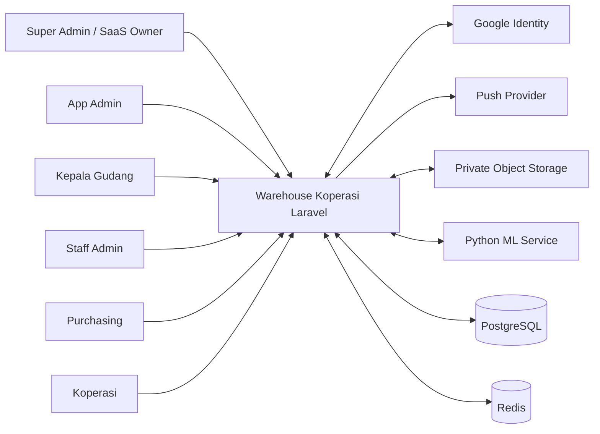
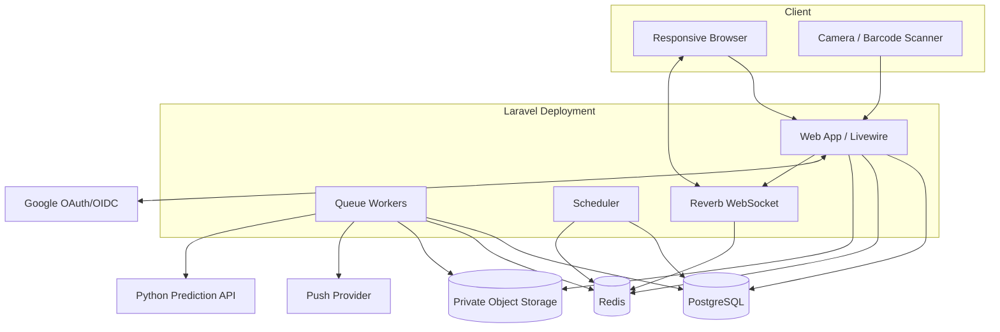
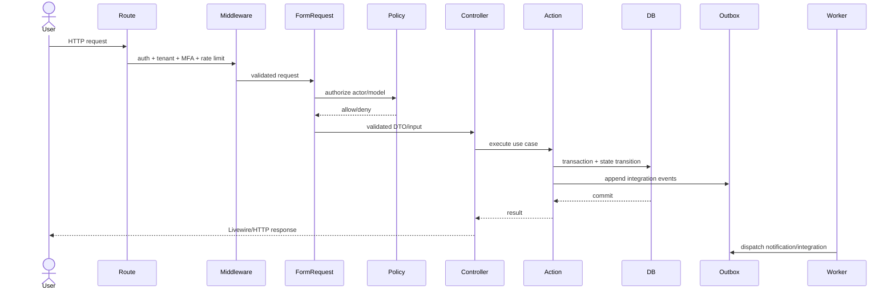
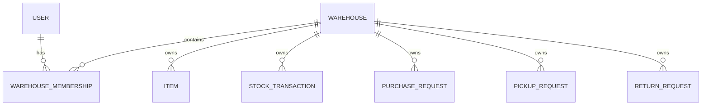
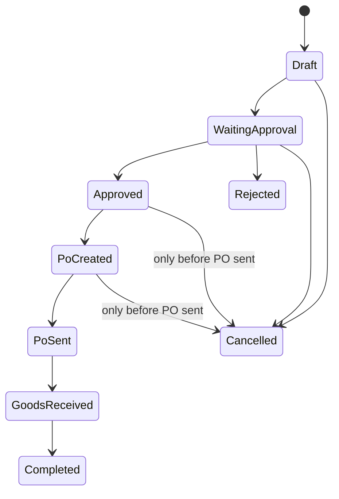
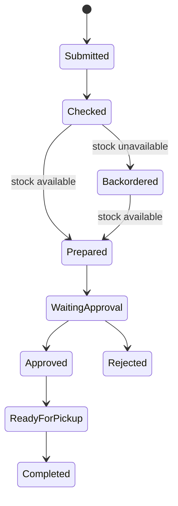
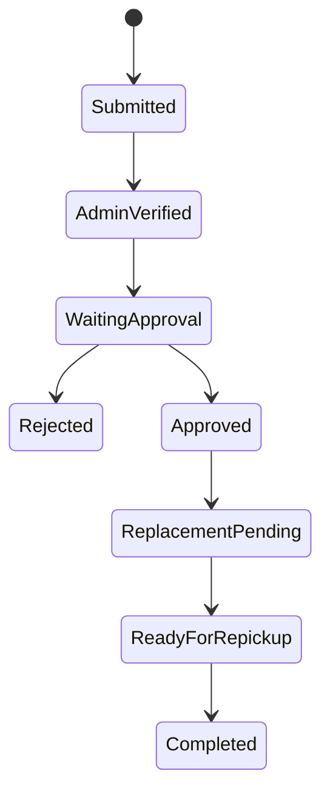

# ARCHITECTURE.md

## 1. Ringkasan Keputusan

Warehouse Koperasi menggunakan **modular monolith Laravel** untuk aplikasi utama dan **service Python terpisah** untuk machine learning pada fase terakhir.

Aplikasi Laravel bertanggung jawab atas identitas, tenancy, ACL, master data, stok, approval, procurement, pickup, retur, notifikasi, audit, dan seluruh source of truth bisnis. Service Python hanya menerima input prediksi yang telah diminimalkan dan mengembalikan rekomendasi. Service Python tidak memiliki kewenangan membuat transaksi, approval, atau Purchase Order.

Keputusan utama:

| Aspek | Keputusan |
|---|---|
| Backend utama | Laravel 13 modular monolith |
| UI | Livewire 4 + Blade + Flux UI + Tailwind |
| Pola kode | MVC + Form Request + Policy + Action/Service + Query Object/Repository terarah |
| Database | PostgreSQL shared schema, tenant-scoped dengan `warehouse_id` |
| Cache/Queue | Redis |
| Real-time | Laravel Reverb/Echo |
| Push | FCM/provider setara |
| File | Private S3-compatible object storage |
| Auth | Google Sign-In via Socialite + Fortify MFA/passkey/TOTP |
| ACL | Laravel Policies/Gates + role/permission tenant-scoped |
| ML | Python API eksternal, fase terakhir |
| Deployment | Laravel web/worker/scheduler/reverb dan Python inference deploy terpisah |

## 2. Architectural Drivers

Arsitektur harus mengoptimalkan:

1. isolasi tenant yang kuat;
2. aturan approval yang dapat diaudit;
3. integritas stock ledger;
4. kecepatan pengembangan tim kecil;
5. kemudahan bagi AI coding agent tanpa mengorbankan review;
6. UI mobile-friendly;
7. operasional dan deployment yang sederhana;
8. kemampuan menambahkan ML tanpa mengikat domain bisnis ke Python;
9. testing yang jelas di boundary modul;
10. perubahan bertahap tanpa microservice sprawl.

## 3. System Context



## 4. Container Architecture



Web request menyelesaikan transaksi bisnis lokal. Side effect yang tidak harus sinkron—push, email, thumbnail, malware scan, export, dan beberapa panggilan ML—dijalankan melalui queue.

## 5. Modular Monolith

### 5.1 Modul

```text
Platform
IdentityAccess
Warehouses
Catalog
Inventory
Procurement
Pickup
Returns
Approvals
Notifications
Audit
Predictions
Shared
```

### 5.2 Tanggung Jawab Modul

#### Platform

- super admin;
- provisioning/suspend warehouse;
- app admin assignment;
- support access dan impersonation;
- system health dan platform settings.

#### IdentityAccess

- Google OAuth callback;
- invitation;
- MFA/passkey/TOTP;
- user/session/device;
- membership;
- role/permission;
- step-up authentication.

#### Warehouses

- warehouse profile;
- tenant context;
- timezone;
- domain policy;
- tenant settings.

#### Catalog

- items/barang;
- barcode;
- unit;
- location;
- supplier master;
- stock minimum parameter.

#### Inventory

- stock ledger;
- stock balance;
- scan in/out;
- critical stock;
- backorder;
- reconciliation.

#### Procurement

- purchase request;
- duplicate warning;
- batching/grouping;
- cancellation;
- PO;
- receipt dan QC.

#### Pickup

- koperasi request;
- stock availability check;
- prepare;
- approval release;
- pickup schedule;
- pickup completion.

#### Returns

- return submission;
- verification;
- fault attribution;
- disposal;
- replacement;
- repickup.

#### Approvals

- approval entity;
- decision engine;
- status transition;
- rejection reason;
- auto-approval audit.

#### Notifications

- inbox;
- web broadcast;
- push;
- notification preferences;
- device tokens.

#### Audit

- append-only audit events;
- security events;
- access logs;
- export/impersonation trail.

#### Predictions

- feature preparation;
- ML client;
- response validation;
- prediction record;
- prediction-to-request;
- direct request flow.

## 6. Source Code Structure

Laravel tidak memerlukan framework module eksternal. Struktur berikut menjaga boundary tanpa menentang konvensi framework:

```text
app/
├── Actions/
│   ├── IdentityAccess/
│   ├── Inventory/
│   ├── Procurement/
│   ├── Pickup/
│   ├── Returns/
│   └── Predictions/
├── Data/
├── Domain/
│   ├── Shared/
│   ├── Inventory/
│   │   ├── Enums/
│   │   ├── Events/
│   │   ├── Exceptions/
│   │   └── ValueObjects/
│   └── ...
├── Http/
│   ├── Controllers/
│   ├── Middleware/
│   └── Requests/
├── Jobs/
├── Listeners/
├── Livewire/
├── Models/
├── Notifications/
├── Policies/
├── Providers/
├── Queries/
├── Repositories/
├── Services/
├── Support/
│   ├── Tenancy/
│   ├── Idempotency/
│   ├── Audit/
│   └── Security/
└── View/
    └── Components/
```

### Aturan Struktur

- Model Eloquent tetap di `app/Models` agar konvensi Laravel jelas.
- Enum/value object boleh dikelompokkan per domain.
- Controller hanya orchestration HTTP.
- Form Request menangani validation dan authorization awal.
- Policy adalah sumber keputusan model-level.
- Action menangani satu use case mutasi.
- Service digunakan untuk capability yang dipakai beberapa action atau integrasi.
- Query Object menangani read model/dashboard/report kompleks.
- Repository hanya digunakan bila ada boundary persistence yang nyata atau query kompleks; generic repository per model dilarang.
- Event domain mengumumkan fakta setelah perubahan state.
- Listener/Job menangani side effect yang dapat asynchronous.

## 7. Request Lifecycle



## 8. MVC Mapping

### 8.1 Models

Core models:

- `User`;
- `Warehouse`;
- `WarehouseMembership`;
- `Invitation`;
- `Role`, `Permission`;
- `Item`;
- `ItemBarcode`;
- `WarehouseLocation`;
- `StockBalance`;
- `StockTransaction`;
- `Supplier`;
- `PickupRequest`, `PickupRequestItem`;
- `PurchaseRequest`, `PurchaseRequestItem`, `PurchaseRequestGroup`;
- `CancellationRequest`;
- `PurchaseOrder`, `PurchaseOrderItem`;
- `GoodsReceipt`, `GoodsReceiptItem`, `QualityInspection`;
- `ReturnRequest`, `ReturnRequestItem`, `ReturnEvidence`;
- `ReplacementRequest` atau relasi ke `PickupRequest`;
- `Approval`;
- `Notification`/database notifications;
- `DeviceToken`;
- `Attachment`;
- `AuditEvent`;
- `SecurityEvent`;
- `Prediction`;
- `OutboxMessage`;
- `IdempotencyKey`.

### 8.2 Views/Livewire Pages

View inventory lengkap berada di `UI-RULES.md`. Komponen page dibagi per domain dan tidak mengandung query lintas tenant tanpa Query Object.

### 8.3 Controllers

Controller minimum:

```text
Auth/GoogleAuthController
Platform/WarehouseController
Platform/AppAdminController
Platform/ImpersonationController
Admin/UserController
Admin/InvitationController
Admin/RolePermissionController
Catalog/ItemController
Catalog/SupplierController
Inventory/StockController
Inventory/StockScanController
Procurement/PurchaseRequestController
Procurement/PurchaseRequestApprovalController
Procurement/CancellationController
Procurement/PurchaseOrderController
Procurement/GoodsReceiptController
Pickup/PickupRequestController
Pickup/PickupApprovalController
Returns/ReturnRequestController
Returns/ReturnApprovalController
Notifications/InboxController
Predictions/PredictionController
Files/AttachmentController
Audit/AuditController
```

Livewire full-page components boleh menggantikan controller untuk halaman UI, tetapi use case tetap memanggil Action/Policy yang sama. API/integration route menggunakan controller khusus.

## 9. Tenancy Architecture

### 9.1 Tenant Model

Tenant utama adalah `Warehouse`. User mendapat akses melalui `WarehouseMembership`.



### 9.2 Tenant Resolution

- User single-warehouse dapat langsung memakai membership aktif.
- User multi-warehouse memilih warehouse aktif setelah login.
- Tenant ID disimpan server-side di session dan diverifikasi terhadap membership setiap request.
- Route tidak menerima warehouse ID sebagai authority tunggal.
- `super_admin` menggunakan platform context; untuk support tenant wajib impersonation/support session.

### 9.3 Database Scoping

- `warehouse_id` pada setiap tabel tenant.
- Tenant-aware model trait menyediakan scope default dan guard creation.
- Policy tetap memeriksa warehouse.
- Query Object selalu menerima tenant context.
- Composite unique indexes, contoh:

```text
unique(warehouse_id, barcode)
unique(warehouse_id, item_code)
unique(warehouse_id, po_number)
unique(warehouse_id, request_number)
```

- File path:

```text
warehouses/{warehouse_uuid}/qc/{year}/{uuid}.jpg
warehouses/{warehouse_uuid}/returns/{year}/{uuid}.jpg
```

## 10. Data Model Prinsip

### 10.1 Identifier

- Gunakan UUID/ULID untuk public identifiers.
- Numeric internal primary key boleh digunakan bila tidak terekspos.
- Nomor manusia seperti `PR-2026-000123` dibuat per warehouse dan unik.

### 10.2 Timestamps

- Simpan UTC.
- Simpan warehouse timezone pada config.
- Gunakan immutable datetime cast bila sesuai.

### 10.3 Soft Delete

- Master data boleh di-archive/soft delete bila relasi historis harus dipertahankan.
- Ledger, approval, audit, dan transaksi terminal tidak dihapus.
- User suspend lebih disukai daripada delete.

### 10.4 Monetary Data

Harga bukan requirement inti PRD. Bila ditambahkan, gunakan integer minor unit/decimal presisi; jangan float.

### 10.5 Quantity

Gunakan decimal presisi jika satuan pecahan dibutuhkan. Bila semua item satuan bulat, gunakan integer. Keputusan per unit harus eksplisit.

## 11. Stock Architecture

### 11.1 Ledger dan Balance

`StockTransaction` adalah source history append-only. `StockBalance` adalah materialized current balance untuk query cepat.

Pada stock movement:

1. authorize actor;
2. validate item dan tenant;
3. begin transaction;
4. lock/version balance row atau gunakan atomic update;
5. append stock transaction;
6. update balance;
7. update request/receipt state;
8. append outbox/audit;
9. commit.

Stock negatif diizinkan sesuai backorder. Namun concurrent update harus tetap konsisten.

### 11.2 Movement Types

```text
RECEIPT
PICKUP_ISSUE
RETURN_DISPOSAL   # tidak menambah stok; boleh audit-only movement
REPLACEMENT_ISSUE
MANUAL_ADJUSTMENT_IN
MANUAL_ADJUSTMENT_OUT
REVERSAL
OPENING_BALANCE
```

Return approved tidak membuat `RECEIPT` ke stok.

### 11.3 Reconciliation

Scheduled job:

```text
SUM(stock_transactions.signed_quantity) == stock_balances.quantity
```

Mismatch menghasilkan security/operational alert dan tidak dikoreksi diam-diam.

## 12. Workflow dan State Machines

Status disimpan sebagai enum. Transisi hanya melalui Action.

### 12.1 Purchase Request



Direct Kepala Gudang request:

```text
Draft -> Approved + Approval(AUTO_APPROVED)
```

### 12.2 Pickup Request



### 12.3 Return



### 12.4 Approval

`PENDING`, `APPROVED`, `REJECTED`, `AUTO_APPROVED`.

Approval bersifat polymorphic tetapi entity reference harus tenant-consistent.

## 13. Transaction Boundaries

Gunakan database transaction untuk:

- invitation acceptance + membership activation;
- role change + audit + session revocation marker;
- stock movement + balance + workflow state;
- approval decision + entity transition + audit/outbox;
- cancellation decision;
- PO creation from grouped request;
- receipt + QC record + stock in;
- return approval + disposal + replacement creation;
- pickup completion + stock out;
- prediction conversion to request.

Jangan melakukan network call di dalam DB transaction. Gunakan outbox/job setelah commit.

## 14. Idempotency dan Concurrency

### 14.1 Idempotency

Endpoint/action berikut memerlukan protection:

- approval/rejection;
- send PO;
- receipt submission;
- pickup completion;
- return approval;
- replacement creation;
- ML request;
- file finalize;
- invitation accept.

Idempotency key scoped ke tenant + actor + operation. Simpan request hash dan response/result reference.

### 14.2 Optimistic Concurrency

Record workflow memiliki `version` atau menggunakan compare-and-set status:

```sql
UPDATE purchase_requests
SET status = 'APPROVED', version = version + 1
WHERE id = ? AND warehouse_id = ? AND status = 'WAITING_APPROVAL' AND version = ?;
```

Affected row `0` berarti stale/conflict.

### 14.3 Locks

- Tidak ada business stock reservation sesuai PRD.
- Redis lock boleh digunakan untuk deduplication/one-at-a-time jobs.
- Database row lock/atomic update tetap boleh dan wajib bila diperlukan untuk integritas teknis.

## 15. Approval Architecture

Approval dibuat sebagai record terpisah dengan snapshot:

```text
approval_type
approvable_type
approvable_id
warehouse_id
requested_by
approver_id
status
reason
requested_at
decided_at
source_version
auto_approved
impersonator_id
metadata
```

Action `Approve*` memanggil Approval service yang:

1. memverifikasi policy;
2. memastikan approver dan segregation;
3. memastikan entity status;
4. menulis decision;
5. menjalankan transition;
6. menulis audit/outbox;
7. mengirim notification setelah commit.

## 16. Purchase Request Batching dan Grouping

- Staff Admin dapat membuat batch input, tetapi database menyimpan line/item yang dapat ditelusuri.
- Purchasing dapat grouping request approved berdasarkan warehouse, supplier candidate, item, dan aturan bisnis.
- Group tidak menghapus relasi request asal.
- Allocation table menghubungkan quantity PO ke request source.
- Satu request Koperasi dapat dipenuhi oleh lebih dari satu purchase flow bila kelak diperlukan, tetapi partial supplier fulfillment tetap di luar scope. Untuk versi awal, grouping harus mempertahankan traceability per quantity.

## 17. Return Fault Attribution

Rule PRD:

- bila bukti pemeriksaan penerimaan tersedia, kesalahan diatribusikan ke gudang;
- bila tidak tersedia, kesalahan diatribusikan ke supplier.

Implementasi harus menyimpan:

- receipt/QC evidence reference;
- rule version;
- computed attribution;
- actor yang mengonfirmasi;
- override bila kelak diizinkan, dengan permission/alasan/audit.

Rule ini terdengar kontra-intuitif pada beberapa konteks bisnis; implementasi tidak boleh “memperbaiki” rule tanpa revisi PRD.

## 18. Notification Architecture

### 18.1 Persistent Inbox

Gunakan Laravel database notifications atau model custom tenant-aware. Inbox menyimpan notification sebagai source of truth.

### 18.2 Channels

- database/inbox: semua notifikasi;
- broadcast: update web real-time;
- push: notifikasi penting, khususnya Kepala Gudang;
- email: invitation dan fallback tertentu.

### 18.3 Outbox

Transaksi bisnis menulis `OutboxMessage`. Worker memproses:

- notification dispatch;
- push;
- email;
- webhook/integration;
- search indexing;
- ML request bila asynchronous.

Outbox consumer idempotent dan mempunyai retry/dead-letter policy.

## 19. File Architecture

`Attachment` menyimpan metadata:

```text
id
warehouse_id
owner_type
owner_id
purpose
storage_disk
storage_key
original_name
safe_mime
size
checksum
status
uploaded_by
created_at
retention_until
```

Flow:

1. client meminta upload intent;
2. backend authorize dan membuat pending attachment;
3. upload ke private storage;
4. worker verify/re-encode/scan;
5. attachment menjadi `READY`;
6. owner workflow hanya menerima attachment `READY`.

Untuk implementasi sederhana, upload melalui Laravel boleh digunakan, tetapi kontrol yang sama tetap berlaku.

## 20. Real-Time Architecture

- Event setelah commit dibroadcast ke private tenant/user channel.
- UI tidak menganggap event sebagai source of truth; setelah event, reload data relevan.
- Channel examples:

```text
private-warehouse.{warehouseUuid}.approvals
private-user.{userUuid}.notifications
private-warehouse.{warehouseUuid}.stock
```

Authorization channel memeriksa membership dan permission.

## 21. Machine Learning Integration

### 21.1 Boundary

Laravel memiliki interface:

```php
interface PurchasePredictionGateway
{
    public function predict(PredictionInput $input): PredictionResult;
}
```

Implementasi:

- `HttpPurchasePredictionGateway` untuk Python;
- `FakePurchasePredictionGateway` untuk test;
- `DisabledPurchasePredictionGateway` sebelum fase ML.

### 21.2 Contract

Request contoh:

```json
{
  "request_id": "01J...",
  "warehouse_ref": "wh_pseudonym",
  "item_ref": "item_pseudonym",
  "horizon_days": 30,
  "history": [
    {"date": "2026-07-01", "outbound_quantity": 12}
  ],
  "requested_at": "2026-08-04T04:53:00Z"
}
```

Response contoh:

```json
{
  "request_id": "01J...",
  "recommendation": 120,
  "horizon_days": 30,
  "model_version": "demand-v1.0.0",
  "fallback": false,
  "metadata": {
    "confidence": 0.82
  }
}
```

Untuk barang tanpa histori:

```json
{
  "recommendation": 0,
  "fallback": true,
  "fallback_reason": "NO_OUTBOUND_HISTORY"
}
```

### 21.3 Rules

- input aggregate, tidak PII;
- timeout dan circuit breaker;
- signed request/mTLS;
- validate schema dan bounds;
- persist request/response metadata;
- no direct side effects;
- model version visible pada audit;
- user tetap membuat keputusan;
- feature flag `ML_SERVICE_ENABLED` default false.

## 22. Query Architecture

Dashboard/report menggunakan Query Object, bukan Eloquent model methods yang membesar.

Contoh:

```text
GetHeadWarehouseDashboard
GetStaffTaskDashboard
GetPurchasingInbox
GetInProgressPurchaseTotalsByItem
GetCriticalStock
GetReturnAttributionEvidence
GetTenantAuditTimeline
```

Query:

- selalu tenant-scoped;
- select kolom yang diperlukan;
- pagination;
- index-aware;
- memiliki test terhadap tenant leak;
- dapat menggunakan database view/materialized view hanya setelah kebutuhan performa terukur.

CQRS penuh tidak digunakan. Pemisahan command/query pada kode hanya untuk keterbacaan.

## 23. Database Index Strategy

Index minimum mengikuti query:

```text
(warehouse_id, status, created_at)
(warehouse_id, item_id, status)
(warehouse_id, barcode)
(warehouse_id, user_id, is_read, created_at)
(warehouse_id, approvable_type, approvable_id)
(warehouse_id, transaction_at)
(warehouse_id, po_number)
(warehouse_id, request_number)
```

Gunakan partial index untuk status aktif/in-progress bila PostgreSQL dan query menunjukkan manfaat.

## 24. Factories dan Seeders

### 24.1 Factory Design

Setiap model utama memiliki Factory dengan states:

```text
active/inactive warehouse
superAdmin/appAdmin/head/staff/purchasing/cooperative
critical/nonCritical/negative stock
waitingApproval/approved/rejected/cancelled/completed
poDraft/poSent/received
returnSubmitted/verified/approved/rejected/replacementPending
read/unread notification
predictionFallback/predictionSuccess/predictionFailure
```

Factory tenant child wajib menerima warehouse parent agar tidak menghasilkan relasi silang.

### 24.2 Seeders

```text
PermissionSeeder
RoleSeeder
PlatformBootstrapSeeder
DemoWarehouseSeeder
DemoUserSeeder
DemoCatalogSeeder
DemoInventorySeeder
DemoWorkflowSeeder
DemoNotificationSeeder
```

Production menjalankan seeder idempotent untuk permission/role saja. Demo seeder dilarang di production.

## 25. Testing Architecture

### 25.1 Unit Tests

- value object;
- status transitions;
- fault attribution;
- duplicate detection;
- permission resolver;
- prediction response validation;
- quantity/stock arithmetic.

### 25.2 Feature Tests

- routes/controllers/actions;
- policies;
- tenancy;
- auth/MFA/invitation;
- workflows end-to-end pada database;
- upload/download;
- notifications.

### 25.3 Integration Tests

- PostgreSQL transactions/concurrency;
- Redis queue/lock;
- Reverb channel auth;
- object storage fake/real staging;
- Google Socialite fake;
- ML fake/stub/contract tests.

### 25.4 Browser Tests

- role dashboards;
- Google callback simulation;
- MFA;
- user management;
- scan fallback;
- approval;
- pickup;
- return;
- cross-tenant URL attempt;
- responsive and accessibility smoke.

### 25.5 Test Data

Gunakan factories, bukan shared static fixtures yang sulit diisolasi. Setiap test membuat tenant sendiri kecuali test eksplisit multi-tenant.

## 26. Observability

### Metrics

- request latency/error rate;
- queue depth/failure;
- DB connection/query latency;
- cache hit/miss;
- Reverb connections;
- push delivery failure;
- file processing failure;
- stock reconciliation mismatch;
- approval aging;
- purchase request aging;
- ML latency/error/circuit state.

### Logs

Structured, correlation ID, actor/warehouse/action/outcome. Redact secrets.

### Tracing

Distributed tracing direkomendasikan untuk Laravel → Python dan provider eksternal.

### Alerts

- high 5xx;
- queue stuck;
- DB saturation;
- repeated cross-tenant denial;
- audit write failure;
- stock mismatch;
- backup failure;
- ML signature/timeout spikes.

## 27. Deployment Architecture

### Laravel

- web process;
- queue workers per queue (`default`, `notifications`, `files`, `exports`, `ml`);
- scheduler single leader;
- Reverb process;
- health/readiness endpoints;
- zero/minimal downtime deployment;
- immutable artifact/container.

### Python ML

- separate deploy;
- private ingress where possible;
- autoscaling independent;
- model artifact versioned;
- health/readiness;
- no direct DB credentials ke database Laravel;
- observability dan rate limit.

### Database Migration

Gunakan expand-migrate-contract:

1. tambah schema backward compatible;
2. deploy code dual compatible;
3. backfill via job;
4. switch reads/writes;
5. remove old schema pada release lain.

## 28. Environments

- local;
- test/CI;
- staging;
- production.

Data production tidak disalin mentah ke local/staging. Gunakan synthetic data atau anonymized snapshot terkontrol.

Feature flags minimum:

```text
ml_prediction
push_notifications
passkeys
impersonation
advanced_exports
```

## 29. Architecture Decision Records

Buat ADR untuk perubahan besar. Minimum ADR yang disarankan:

```text
0001-modular-monolith-laravel.md
0002-shared-schema-tenancy.md
0003-livewire-flux-ui.md
0004-google-fortify-auth.md
0005-role-permission-and-policies.md
0006-stock-ledger-and-balance.md
0007-transactional-outbox.md
0008-private-object-storage.md
0009-python-ml-service-boundary.md
0010-super-admin-impersonation.md
```

## 30. Architecture Fitness Functions

CI harus menjaga aturan berikut:

- semua tenant model memiliki `warehouse_id`/trait dan policy;
- module dependency tidak circular;
- controller tidak berisi business transaction besar;
- no raw `find($id)` pada tenant model di HTTP path tanpa scoped helper;
- no direct status mass assignment;
- stock ledger immutable;
- approval action menghasilkan audit;
- queue job tenant-aware;
- no public storage untuk evidence;
- ML module tidak diakses bila feature flag off;
- dependency boundaries diuji dengan architecture test bila tooling dipilih.

## 31. Deliberate Non-Choices

Tidak dipilih pada fase awal:

- microservices untuk setiap modul;
- event sourcing penuh;
- CQRS/read database terpisah;
- Kubernetes sebagai requirement;
- generic repository untuk semua model;
- GraphQL;
- mobile native;
- database-per-tenant;
- autonomous procurement;
- ML di proses PHP/Laravel.

Keputusan dapat dievaluasi ulang berdasarkan data penggunaan, bukan preferensi teknis semata.
