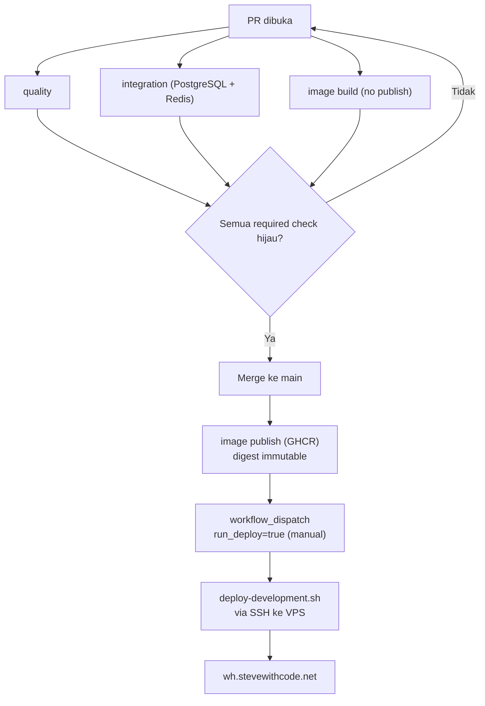

# CI/CD

Setiap pull request wajib lolos satu workflow GitHub Actions (`.github/workflows/ci-cd.yml`) sebelum bisa di-merge ke `main`. Detail lengkap dan mengikat ada di `CI.md` (integrasi) dan `CD.md` (deployment) di root repo — halaman ini ringkasannya.

## Required checks

Tiga job ini **wajib hijau** sebelum PR bisa merge — nama persis yang dicek GitHub ruleset di `main`, tanpa bypass actor sama sekali (termasuk admin repo):

- **`quality`** — Pint, PHPStan level 7, full test suite, security regression suite, dependency audit, Gitleaks. Jalur SQLite cepat.
- **`integration (PostgreSQL + Redis)`** — full test suite dijalankan ulang di atas PostgreSQL 16 + Redis 7 sungguhan, bukan SQLite.
- **`image build (no publish)`** — memastikan image Docker (`runtime` dan `web`) benar-benar bisa dibuild, tanpa push kemana pun.

`image publish (GHCR)` dan `deploy-development` **sengaja bukan required check** — keduanya `skipped` di PR (hanya jalan di `main`/manual dispatch), jadi mensyaratkan check yang selalu skip di PR akan mengunci merge selamanya.

## Setelah merge

- **`image publish (GHCR)`** jalan otomatis di push ke `main`, build ulang (murah, pakai BuildKit cache) dan push image dengan digest immutable (`sha256:...`, bukan tag `latest`) ke `ghcr.io/stephenprasetyachrismawan/warehouse-koperasi` dan `-web`.
- **Deploy ke VPS development tidak otomatis.** Harus dipicu manual lewat `workflow_dispatch` dengan input `run_deploy=true`, dan selalu memakai digest image dari run yang sama (bukan digest yang dipilih manual).

## Kalau ada check yang merah

Jangan coba melewati gate-nya (menonaktifkan job, melonggarkan assertion, menurunkan level PHPStan, `continue-on-error: true`). Investigasi log job yang gagal (`gh run view --job --log-failed`), cari akar masalahnya, perbaiki di sumbernya. Aturan lengkapnya ada di `CI.md` §7.
